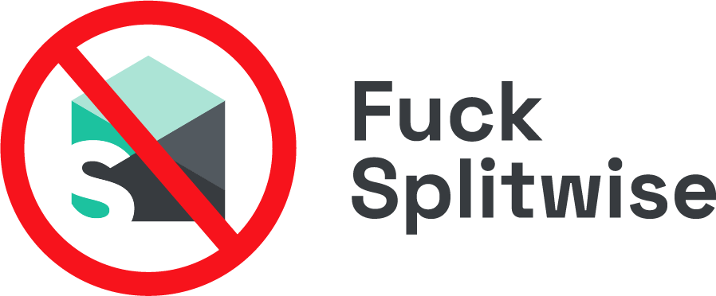

# Fuck Splitwise

**Splitwise really sucks.**

I genuinely don't understand why some of my friends insist on using it every time we need to split bills. The UX is clunky, things feel slow, half the features are paywalled, and somehow something as simple as "who owes who" becomes annoying.

Luckily, my housemates never fell for this notorious app.
We've always gone the traditional, simple way of splitting bills.

So…
fuck Splitwise and welcome to a lightweight, no-BS bill-splitting web app.

## What this is

A simple, mobile-first web app for splitting bills with friends:

- No overengineering
- No social feed
- No ads
- No "premium" nonsense

Just:

- what you paid
- what others owe you
- what you owe others

That's it.

## Tech Stack

Built with modern, boring, reliable tools:

- Nuxt 3 (Vue)
- Nitro (server routes)
- Neon Postgres
- Drizzle ORM
- Nuxt Auth / Auth Utils
- Tailwind CSS
- Deployed on Vercel

No microservices.
No unnecessary abstractions.

## Design Philosophy

If a bill-splitting app needs a tutorial, it has already failed.

This app is:

- single main screen
- two tabs:
  - Owed to me
  - I owe
- one big Create Bill button

Everything else is noise.

## Status

Still under active development haiyaa

Expect rough edges, breaking changes, and opinionated decisions.

## Disclaimer

This is not meant to replace Splitwise for everyone.
If you enjoy spreadsheets, ads, and premium upsells — you're probably happier there.

For everyone else: welcome.
